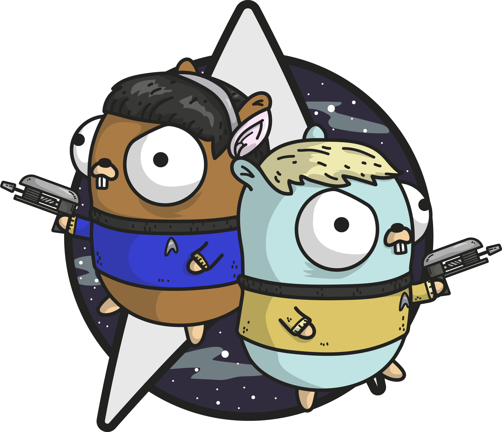

<p align="center">

</p>

# Spok

[](https://github.com/FollowTheProcess/spok)
[](https://goreportcard.com/report/github.com/FollowTheProcess/spok)
[](https://github.com/FollowTheProcess/spok)
[](https://github.com/FollowTheProcess/spok/actions?query=workflow%3ACI)

*It's a build system Jim, but not as we know it!*

* Free software: Apache Software License 2.0

## Project Description

:warning: Spok is in early development and is not ready for use yet!

`spok` is a lightweight build system and command runner inspired by things like [make], [just] and others.

On top of this, `spok` provides:

* A cleaner, more "developer friendly" syntax
* Fully cross compatible (tested on Windows, Linux and Mac)
* Incremental runs based on file hashing and sum checks (not dates like e.g. [make]), so nothing runs if nothing's changed!
* Parallel execution by default (unless task dependencies preclude this)
* More features TBC

## Installation

## Quickstart

`spok` is driven by a single file (usually placed in the root of your project) called `spokfile`. The best way of describing a `spokfile` is a cross between a makefile, Go and Python!

It looks like this:

<!-- Ignore the python syntax highlighting, it's obviously not python. It's just what looked best -->
```python
# Comments are preceeded by a hash

# You can store global variables like this (caps are optional)
GLOBAL_VARIABLE := 27

# You can store the output of a shell command as a variable
GIT_COMMIT := exec(git rev-parse HEAD)

# The core concept in spok is a task (think make target)
# they are sort of based on go functions except arguments are dependencies
# A dependency can be filepaths (including globs) or names of other tasks

# Tasks have optional outputs (if they generate things)
# This enables `spok clean` to restore everything to it's original state

# A comment above a task is it's docstring
task <name>(<deps>?...) -> <outputs>?... {
    # The commands to actually run
}

# Some simple examples below

# Use a global variable like this
task hello() {
    echo "{{.GLOBAL_VARIABLE}}"
}

# Run the go tests
task test("**/*.go") {
    go test ./...
}

# Format the project source code
task fmt("**/*.go") {
    go fmt ./...
}

# Compile the program (depends on fmt, fmt will run first)
# also outputs a build binary
task build("**/*.go", fmt) -> "./bin/main" {
    go build
}

# Can register a default task (spok by default just prints the help)
task default() {
    echo "default"
}
```

### Credits

This package was created with [cookiecutter] and the [FollowTheProcess/go_cookie] project template.

Logo taken from [https://periclestheo.com/blog/pointer-misuse-in-go](https://periclestheo.com/blog/pointer-misuse-in-go)

[cookiecutter]: https://github.com/cookiecutter/cookiecutter
[FollowTheProcess/go_cookie]: https://github.com/FollowTheProcess/go_cookie
[make]: https://www.gnu.org/software/make/
[just]: https://github.com/casey/just
